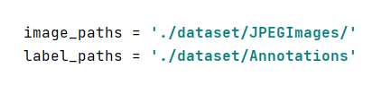
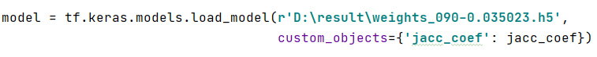

#XM-UNet
## 训练方法(Training method)


设置图片的数据集为本地的位置，随后在命令行中输入以下的命令

Modify the location of the dataset, and then enter the following command on the command line
```shell
    mkdir "models"
    python train.py
```

## 验证方法(Eveluate method)


设置模型所在的位置，随后在命令行中输入以下的命令

Set the location of the model, and then enter the following command on the command line
```shell
    python test.py
```

## 预训练模型的下载地址(Download Pretraining model)
https://pan.baidu.com/s/1DhL0ycsezjE93ZewodVfbQ  (f0r1)

## 需要的环境（Environment needed）

```
    tensorflow == 2.3.2
    keras == 2.4.3
```